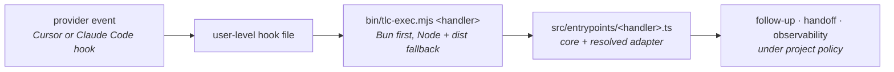

# harness-toolkit

Steers Cursor and Claude Code agents with **gates → follow-up → handoff → policy**.

On stop (and related hooks), the runtime can re-check work, require verified ship claims, persist handoff
state, and constrain subagent model choice — the same steering logic, driven through a provider-neutral
core and one anti-corruption-layer adapter per provider.

## Start here

While this repository is private to the `tech-leads-club` org, install with the `gh` CLI — an
unauthenticated fetch cannot read a private repository:

```bash
gh api repos/tech-leads-club/harness-toolkit/contents/install.sh --jq .content | base64 -d | bash
```

Once it is public, this is the same install with no CLI needed:

```bash
curl -fsSL https://raw.githubusercontent.com/tech-leads-club/harness-toolkit/main/install.sh | bash
```

Then restart Cursor or Claude Code. That is the whole setup — the installer finds which of the two you
have and wires only those, and the harness works in every repository right away with a safe baseline.

To give one project its own rules, open it and say **"setup harness"** to the agent, or run
`tlc harness init --minimal`. To check anything, run `tlc harness doctor`.

## Table of contents

1. [Start here](#start-here)
2. [Why it exists](#why-it-exists)
3. [Providers](#providers)
4. [Requirements](#requirements)
5. [Install](#install)
6. [Update](#update)
7. [Quick start](#quick-start)
8. [How it works](#how-it-works)
9. [Commands](#commands)
10. [Connect a project](#connect-a-project)
11. [Paths and shared state](#paths-and-shared-state)
12. [Ship claims](#ship-claims)
13. [Price catalogs](#price-catalogs)
14. [Windows](#windows)
15. [Troubleshooting](#troubleshooting)
16. [Documentation](#documentation)
17. [Contributing](#contributing)
18. [License](#license)

## Why it exists

| Goal | Mechanism |
|------|-----------|
| Hold a line no setting can cross | Floor tier, evaluated before any config is read |
| Catch breakage early | Optional grind (lint/test) on stop |
| Block false ship claims | `HARNESS_SHIP_CLAIM` + evidence |
| Keep narration out of the diff | Comment gate on added lines, by declared reason |
| Survive context loss | Handoff + lessons on disk |
| Control cost/quality | Subagent model allowlist (per provider) |
| Measure what happened | Observability + cost catalogs, tagged by provider |
| See cost across every repo | Optional global observability spool under the runtime home |
| Fail scope creep like a test | Plan gate: `HARNESS_PLAN` vs the diff, deviations need a stated reason |
| Never obey content read from outside | Untrusted-content framing, once per turn |
| Let CI and agents read the output | `--json` on every read command |

### The floor

Five rules read no configuration at all, so nothing in a config file and no edit by an agent can clear
them. Every denial names its rule.

| Rule | Denies |
|------|--------|
| `outside-project-destruction` | A destructive command whose target resolves outside the repo and outside the OS temp directory |
| `unprovable-destruction` | A destructive verb whose target is a variable, a substitution, or built at runtime |
| `secret-access` | A read that would pull `.env`, `~/.ssh`, `~/.aws`, `*.pem` or similar into the transcript |
| `history-rewrite` | `git push --force`. `--force-with-lease` is allowed, since it refuses when the remote moved |
| `machine-control` | `shutdown`, `reboot`, `halt`, `poweroff` |
| `policy-surface-write` | Any shell route to `.tlc/harness/config.json`, `flags/` or `state/` — a redirect, an interpreter, a heredoc program — plus the same paths under the runtime home `~/.tlc/harness`, and `tlc harness pause \| resume \| grind \| mode \| init \| gate` from inside an agent session |

Harness policy and state are not agent-writable, through a tool or a shell. Reading them stays allowed: a
proven reader (`cat`, `grep`, `jq`, `test`, `git show`) on those paths passes, and anything not proven to only
read does not — and the refusal names the way through, including `tlc harness handoff`. Policy changes are the operator's, from a terminal outside the agent session:

```bash
tlc harness gate test-command node --test 'src/**/__test__/*.test.ts'
tlc harness gate lint-command npx biome check .
```

The harness also hashes every policy source at session start. If one changes mid-session without a
`tlc harness` command, the next tool call is refused and the change reported — the layer that covers what
shell parsing cannot see.

Everything else is opt-in: 21 capabilities, each presented with benefit, trade-off and default by the init
skill. Full list in [`docs/architecture.md`](docs/architecture.md).

Runtime: `~/.tlc/harness`.
Project policy: `<repo>/.tlc/harness/config.json`.

## Providers

Both providers share one runtime, one project policy file, and one on-disk state directory. Core steering
logic never imports a provider adapter and never branches on a provider's name — see
[`docs/architecture.md`](docs/architecture.md) and [`docs/providers/index.md`](docs/providers/index.md).

| Provider | Detected by | User-level wiring | Docs |
|----------|-------------|--------------------|------|
| **Cursor** | `CURSOR_CONFIG_DIR`, else `~/.cursor` | `<resolved>/hooks.json` (replaced) | [`docs/providers/cursor.md`](docs/providers/cursor.md) |
| **Claude Code** | `CLAUDE_CONFIG_DIR`, else `~/.claude` | `<resolved>/settings.json` `hooks` block (merged) | [`docs/providers/claude-code.md`](docs/providers/claude-code.md) |

The installer and `tlc harness init` detect which of these are present and wire only those — neither
assumes Cursor.

## Requirements

| Dependency | Notes |
|------------|--------|
| **Bun** *or* **Node.js 24+** | Either one is enough. Bun runs every hook directly with no build step (~1 ms/hook); Node needs 24 LTS or 26 and the shipped `dist/` (~27 ms/hook). With neither, the installer stops and names both fixes |
| **git** | Installer clone/update |
| **esbuild** (only for the Node path) | Needed once to recompile `dist/`; the published `dist/` already works |

| Environment | Installer |
|-------------|-----------|
| Linux / macOS / WSL | `install.sh` |
| Windows | `install.ps1` (see [Windows](#windows)) |

## Install

Both routes run the same `install.sh` and produce the same managed runtime. The difference is only how the
script is fetched: `raw.githubusercontent.com` is unauthenticated and cannot read a private repository, and
`gh` carries your GitHub credential. Use the `gh` form until the repository is public.

**Linux / macOS / WSL**

```bash
# while private — needs `gh auth login` and membership of the tech-leads-club org
gh api repos/tech-leads-club/harness-toolkit/contents/install.sh --jq .content | base64 -d | bash

# once public
curl -fsSL https://raw.githubusercontent.com/tech-leads-club/harness-toolkit/main/install.sh | bash
```

**Windows (PowerShell)**

```powershell
# while private
$s = gh api repos/tech-leads-club/harness-toolkit/contents/install.ps1 --jq .content
[Text.Encoding]::UTF8.GetString([Convert]::FromBase64String($s)) | iex

# once public
irm https://raw.githubusercontent.com/tech-leads-club/harness-toolkit/main/install.ps1 | iex
```

The clone the installer then performs also needs that credential while the repository is private: run
`gh auth setup-git` once, and the installer says so if the clone fails.

Install target: `~/.tlc/harness` (runtime). The init skill is linked into the skills directory of
each provider it finds, because a provider only reads its own.

The installer:

1. Clones or updates the runtime at `~/.tlc/harness`
2. Creates `config.json` from `config.example.json` when missing
3. Adds `tlc` to `~/.local/bin`
4. Links the init skill into each detected provider's `skills/harness-init`
5. Wires user-level hooks for every provider it detects installed, in that provider's resolved config
   directory

Overrides: `TLC_HOME`, `TLC_REPO_URL`, `TLC_BIN_DIR`.

Provider config directories are resolved, not assumed: `CLAUDE_CONFIG_DIR` and `CURSOR_CONFIG_DIR` are
honoured when set, so a relocated config is wired correctly. `tlc harness doctor` prints the resolved
target for each provider.

Restart or reload the provider session after install.

**From a git clone** (same installers; then build `dist/`):

```bash
git clone https://github.com/tech-leads-club/harness-toolkit.git
cd harness-toolkit
./install.sh
./bin/tlc-build
```

```powershell
git clone https://github.com/tech-leads-club/harness-toolkit.git
cd harness-toolkit
.\install.ps1
.\bin\tlc-build
```

## Update

```bash
tlc harness update
```

Moves the runtime to upstream, refreshes CLI + init skill + provider wiring, then runs doctor.
Reload/restart the provider session afterward if hooks or the init skill should refresh.

**The runtime path is an artifact the harness owns**, and update never touches anything else
([AD-046](docs/decisions/ad-046.md)):

| `tlc harness doctor` says | What update writes |
| --- | --- |
| `managed checkout` | moves it to upstream with a hard reset. Do not develop there — a local change is discarded |
| `link to a working clone` | nothing in the clone. That is a contributor install; you pull it yourself |

`dist/` is rebuilt only when a bundle is missing. Rebuilding a complete `dist/` is what used to dirty the checkout
and break every later update, because Bun and esbuild emit different bytes for the same source.

**If `update` aborts on `dist/`, re-run the install one-liner once.** A stuck install cannot deliver its own fix —
the fix lives in the revision `update` has to fetch — so the one-liner, which is fetched fresh from upstream, is
the recovery route. It hard-resets a managed checkout and leaves `config.json`, `state/` and any linked clone
untouched ([AD-048](docs/decisions/ad-048.md)). There is no `--force`.

After a successful pull, prints a short digest of **optional catalog capabilities this project has not
enabled yet** (benefit + trade-off + how to enable). Nothing is auto-enabled — use the harness-init skill or
edit `.tlc/harness/config.json`.

`tlc harness doctor` emits non-blocking `WARN:` lines for the same off/missing opt-ins (and for default-on
features you explicitly set to `false`).

## Quick start

```bash
tlc harness doctor
tlc harness help
tlc harness status
```

Healthy install checklist:

- Bun on PATH, or Node 24+ for the `dist/` fallback path
- `~/.tlc/harness` present with `dist/*.mjs`
- At least one provider's user-level hooks invoke `tlc-exec`
- `tlc` on PATH (open a new shell if needed)

## How it works



| Layer | Location |
|-------|----------|
| Runtime | `~/.tlc/harness` |
| Cursor user hooks | `<cursor config>/hooks.json` |
| Claude Code user hooks | `<claude config>/settings.json` (`hooks` block) |
| Project policy | `<repo>/.tlc/harness/config.json` |
| Project shim (per provider) | `<repo>/.cursor/hooks.json`, `<repo>/.claude/settings.json` |

Entrypoint: `bin/tlc-exec.mjs`.
Wrappers: `bin/tlc`, `bin/tlc-exec` (Unix); `bin/tlc.cmd`, `bin/tlc-exec.cmd` (Windows).

See `tlc harness help architecture` or [`docs/architecture.md`](docs/architecture.md).

## Commands

| Command | Purpose |
|---------|---------|
| `tlc harness status` | Mode, grind, gates |
| `--json` on any read command | Machine-readable output: `status`, `doctor`, `obs`, `lessons`, `prices lookup` |
| `tlc harness update` | Pull runtime + refresh skill/CLI/wiring + doctor |
| `tlc harness doctor` | Health checklist |
| `tlc harness help [topic]` | Docs |
| `tlc harness build` | Compile `dist/` for the Node fallback path |
| `tlc harness test` | Run the full local gate |
| `tlc harness grind [on\|off]` | Lint/test follow-ups on stop |
| `tlc harness pause` / `resume` | Disable / enable stop checks |
| `tlc harness mode solo\|paired\|focus` | Operator posture |
| `tlc harness attest` | Tamper-evident record of what each session ran under |
| `tlc harness handoff` | Handoff state between turns and sessions — the sanctioned reader |
| `tlc harness obs live` / `obs report` | Signal / session rollup |
| `tlc harness prices refresh` / `lookup` | Cost catalogs |
| `tlc harness lessons list` | Lessons across the three tiers, with staleness and effectiveness |
| `tlc harness lessons add "…" [--ref path:symbol] [--global] [--pin]` | Write a lesson; `--ref` retires it when that stops resolving, `--pin` puts it ahead of ranking |
| `tlc harness init --minimal` | Project stub |

## Connect a project

1. Open the repository in Cursor and/or Claude Code.
2. Run `tlc harness init --minimal`, or ask the agent to run the harness-init skill.
3. Confirm `.tlc/harness/config.json` and the shim hooks for whichever provider(s) you use.
4. Run `tlc harness doctor` from the project root.

Details: `tlc harness help init` or [`docs/init.md`](docs/init.md).

## Paths and shared state

Both providers read and write the **same** project state — there is one `.tlc/harness/state/`, not one per
provider. Records inside it (signal, debug, audit) carry a `provider` field per event.

| Path | Contents |
|------|----------|
| `~/.tlc/harness` | Runtime |
| `~/.tlc/harness/state/lessons.json` | Global lesson tier — this machine, every product ([AD-040](docs/decisions/ad-040.md)) |
| `<cursor config>/hooks.json` | Cursor user hooks (if Cursor installed) |
| `<claude config>/settings.json` | Claude Code user hooks, `hooks` block (if Claude Code installed) |
| `<provider config>/skills/harness-init` | Init skill, linked per detected provider from runtime `skills/harness-init` |
| `<repo>/.tlc/harness/config.json` | Project policy (tracked) |
| `<repo>/.tlc/harness/state/` | Handoff, obs, audit, project-tier `lessons.json`, ship ledger (gitignored) |

Do not use `~/.tlc/harness` for anything other than the installed runtime — see
[`docs/decisions/ad-002.md`](docs/decisions/ad-002.md) for why the layout is namespaced this way.

## Ship claims

Protocol line (free-form "done/shipped" is ignored):

```text
HARNESS_SHIP_CLAIM: <one-line summary>
```

When `shipGate` is enabled and runtime paths changed, cite recent PASS under `evidenceDir`.
See `tlc harness help concepts` or [`docs/concepts.md`](docs/concepts.md).

## Price catalogs

```bash
tlc harness prices refresh
tlc harness prices refresh cursor
tlc harness prices refresh litellm
tlc harness prices lookup <model-id> [provider]
```

See `tlc harness help prices` or [`docs/measure.md`](docs/measure.md).

## Windows

Path resolution goes through `os.homedir()` only, hooks use exec form, filenames are sanitized,
atomic writes retry, and the CLI ships a `.cmd` shim alongside directory junctions
([`docs/decisions/ad-006.md`](docs/decisions/ad-006.md)).

CI runs the full suite and the `dist/` build on `windows-latest` on every push.

Outside CI coverage: `install.ps1`, and hooks firing inside a Cursor or Claude Code session on Windows.

## Troubleshooting

| Symptom | Action |
|---------|--------|
| `tlc: command not found` | New shell; ensure `~/.local/bin` on PATH; re-run install |
| Hooks never fire | Reload/restart the provider session; check the provider's own hook log; confirm `tlc-exec` |
| Missing `dist/` | `tlc harness build` |
| Cost `null` | `tlc harness help prices` |
| Project doctor FAILs | Expected until project policy exists |

See `tlc harness help diagnose` or [`docs/diagnose.md`](docs/diagnose.md).

## Documentation

Full OKF v0.1 documentation bundle: [`docs/index.md`](docs/index.md).

## Contributing

[`CONTRIBUTING.md`](./CONTRIBUTING.md) · [`SECURITY.md`](./SECURITY.md)

## License

**PolyForm Noncommercial 1.0.0** — [`LICENSE`](./LICENSE), [`NOTICE`](./NOTICE).

| Allowed | Requires separate license |
|---------|---------------------------|
| Noncommercial use, change, distribute with attribution | Commercial use |
| Keep `Required Notice` + license terms | Dropping attribution |
