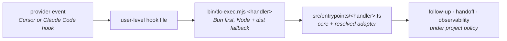

# harness-toolkit

Steers Cursor and Claude Code agents with **gates → follow-up → handoff → policy**.

Hooks fire on the editor's own events. The harness answers each one with a decision — allow, ask, deny, or
text injected into the turn — and writes a record of what it decided and why.

- **[Everything it validates](#everything-it-validates)** — the whole list, one row per check
- **[How to see any of it](#how-to-see-any-of-it)** — the command behind each row
- **[How to explain a decision](#how-to-explain-a-decision)** — from a message on screen back to the rule

## Start here

While this repository is private to the `tech-leads-club` org, install with the `gh` CLI — an
unauthenticated fetch cannot read a private repository:

```bash
gh api repos/tech-leads-club/harness-toolkit/contents/install.sh --jq .content | base64 -d | bash
```

Once it is public, this is the same install with no CLI needed:

```bash
curl -fsSL https://raw.githubusercontent.com/tech-leads-club/harness-toolkit/main/install.sh | bash
```

Then restart Cursor or Claude Code. That is the whole setup — the installer finds which of the two you
have and wires only those, and the harness works in every repository right away with a safe baseline.

To give one project its own rules, open it and say **"setup harness"** to the agent, or run
`tlc harness init --minimal`. To check anything, run `tlc harness doctor`.

## Table of contents

1. [Start here](#start-here)
2. [Everything it validates](#everything-it-validates)
   - [Tier 1 — the floor](#tier-1--the-floor-no-configuration-reaches-it)
   - [Tier 2 — always on, no switch](#tier-2--always-on-no-switch)
   - [Tier 3 — the rails you choose](#tier-3--the-rails-you-choose)
3. [How to see any of it](#how-to-see-any-of-it)
4. [How to explain a decision](#how-to-explain-a-decision)
5. [Providers](#providers)
6. [Requirements](#requirements)
7. [Install](#install)
8. [Update](#update)
9. [Quick start](#quick-start)
10. [How it works](#how-it-works)
11. [Commands](#commands)
12. [Connect a project](#connect-a-project)
13. [Paths and shared state](#paths-and-shared-state)
14. [Ship claims](#ship-claims)
15. [Price catalogs](#price-catalogs)
16. [Windows](#windows)
17. [Troubleshooting](#troubleshooting)
18. [Documentation](#documentation)
19. [Contributing](#contributing)
20. [License](#license)

## Everything it validates

Three tiers, and which tier a check is in decides whether you can turn it off.

| Tier | Count | Configurable | Runs |
|------|-------|--------------|------|
| [Floor](#tier-1--the-floor-no-configuration-reaches-it) | 7 rules | Never | Before any policy is loaded, on every tool call, shell command and read |
| [Always on](#tier-2--always-on-no-switch) | 3 checks | Never | After the floor, on every acting event |
| [Rails](#tier-3--the-rails-you-choose) | 23 capabilities | Each one, individually | Where the table says |

Nothing else runs. If a message on your screen is not from one of the thirty-three rows below, it is not the
harness.

### Tier 1 — the floor, no configuration reaches it

Evaluated before the policy file is read, so no setting and no edit by an agent can clear one. Every denial
prints `rule=<name>`, and the name is the first column here.

<!-- generated:floor -->

| Rule | Denies | Allowed anyway |
|---|---|---|
| `outside-project-destruction` | a destructive command whose target resolves outside the repository and outside the OS temp directory | the same command inside the repository, or inside the temp directory |
| `unprovable-destruction` | a destructive verb whose target is a variable, a command substitution, or otherwise built at runtime — the harness cannot see what it would delete | a literal path it can resolve and check |
| `secret-access` | a read that would copy a credential into the transcript — `.env`, `~/.ssh`, `~/.aws`, `*.pem` and similar through a shell reader or the editor's own read tool, and the instance metadata service through any verb that speaks to the network | searching local files for the literal address, because `grep` and its kin make no request |
| `history-rewrite` | `git push --force` | `--force-with-lease`, which refuses on its own when the remote moved |
| `machine-control` | `shutdown`, `reboot`, `halt`, `poweroff` | — |
| `unprovable-execution` | a program fetched over the network and handed to a shell — piped, process-substituted, or inside a shell's `-c`/`eval` substitution. The gate cannot read what would run | a fetch with no shell downstream, and a shell fed a local file the gate can read |
| `policy-surface-write` | every route an agent has to harness policy and state — a shell redirect, an interpreter, a heredoc program, or a write tool — in the project and under the runtime home, plus the mutating `tlc harness` subcommands from inside a session | reading them with a proven reader (`cat`, `head`, `grep`, `jq`, `ls`, `stat`, `test`), and `tlc harness handoff` for the handoff state |

<!-- /generated -->

Policy changes are the operator's, from a terminal outside the agent session:

```bash
tlc harness gate test-command node --test 'src/**/__test__/*.test.ts'
tlc harness gate lint-command npx biome check .
```

### Tier 2 — always on, no switch

Not floor rules, and equally unconfigurable — each one detects a condition that a config field could
otherwise switch off.

| Check | Fires on | Verdict | What it checks | How to see it |
|---|---|---|---|---|
| `policy-baseline-divergence` | every acting event | `deny` | Every policy source is hashed at session start. If one changes mid-session with no `tlc harness` command behind it, the next acting call is refused and the path named. Reads still pass, so the agent can investigate and report | `tlc harness policy` lists what changed; `tlc harness policy accept <path>` clears it |
| `policy-surface-write` (tool half) | `tool.before` | `deny` | An agent write to policy or state through Write, Edit, Delete, MultiEdit or NotebookEdit — the same paths the floor's shell half covers | `tlc harness obs report` — refusals by rule |
| `edit-collision` | `tool.before` | `ask` | Another live session in the same working tree touched this file recently | `tlc harness status` lists the live sessions |

### Tier 3 — the rails you choose

All 23 are off unless the **default** column says `on`, and each was presented with its benefit and its
trade-off when you ran the init wizard. `configPath` is the key in `.tlc/harness/config.json`.

<!-- generated:validates -->

| Rail · key · default | What it checks | Fires on | Verdict | How to see it |
|---|---|---|---|---|
| **Grind (lint/test on stop)**<br>`grind.enabled` · off | Runs your lint and test commands against the files the turn changed, and sends the agent back until they pass. | `stop` | `follow-up` | tlc harness obs report — runs, wall-clock and total; the last verdict is in the project state directory as last-gate.json |
| **Ship gate**<br>`shipGate.enabled` · off | Checks a declared ship claim against recent PASS evidence for the runtime paths the turn touched. | `stop` | `block-stop` | tlc harness obs report; the ship ledger in the project state directory records every claim, challenge and pass |
| **Empty-diff anti-ship**<br>`shipGate.emptyDiffAntiShip` · off | Checks that a ship claim has a non-empty diff behind it. | `stop` | `block-stop` | the ship ledger in the project state directory — the challenge row names the empty diff |
| **Comment gate (agent-added comments)**<br>`comments.enabled` · off | Checks the comment lines this turn added against the commit the turn started from: by reason, by resolvability, or none. | `stop` | `block-stop` | tlc harness obs report — the comments gate appears among the gate outcomes |
| **Duplication gate (agent-added copies)**<br>`duplication.enabled` · off | Checks whether the runs of code this turn added already exist somewhere else in the project. | `stop` | `block-stop` | tlc harness obs report — the duplication gate appears among the gate outcomes |
| **Supply-chain gate (dependencies this turn added)**<br>`supplyChain.enabled` · off | Checks what this turn added to the dependency graph: a manifest that moved without its lock, or an unpinned version. | `stop` | `block-stop` | tlc harness obs report — the supply-chain gate appears among the gate outcomes |
| **Subagent allowlist**<br>`subagents.enforceAllowlist` · off | Checks a subagent's model against the list you wrote, and against the blocked *-fast shapes. | `tool.before`<br>`subagent.start` | `deny` | tlc harness obs report — refusals attributed by rule; the denial text names subagents.allowedModels and lists what is permitted |
| **Block parent Fast mode for Task spawns**<br>`subagents.blockParentFast` · off | Checks whether the parent chat is in Fast mode before letting it spawn a subagent. | `tool.before`<br>`subagent.start` | `deny` | tlc harness obs report — refusals by rule; tlc harness status shows the sticky parent model it read |
| **Shell stall detection**<br>`shell.stallDetection` · off | Counts identical shell commands in a row and stops the loop at your threshold. | `shell.before` | `deny` | tlc harness obs report — interruptions attributed to the shell-stall rule |
| **Catastrophic shell ask**<br>`shell.catastrophicAsk` · **on** | Checks a shell command for destruction that reaches outside the workspace. | `shell.before` | `ask` | tlc harness obs report — interruptions attributed to the shell-catastrophic rule |
| **Lessons**<br>`intelligence.lessons.enabled` · off | Records what a repeated gate failure taught, ranks it, and injects it into the next session and retry. | `session.start`<br>`stop`<br>`session.end` | `context` | tlc harness lessons list — every tier with staleness and effectiveness; obs report shows the characters each injection cost |
| **Budget continue**<br>`intelligence.budgetContinue` · off | Checks for unfinished handoff work under context pressure and says keep going rather than wrap up. | `stop` | `follow-up` | tlc harness handoff — the follow-up fires only with unfinished work recorded there |
| **Gap feedback**<br>`intelligence.gapFeedback` · **on** | Turns a gate's output into a numbered list of gaps the retry has to close. | `stop` | `follow-up` | tlc harness handoff — the gaps it injects are the ones stored as previous_gaps |
| **Failure classification**<br>`intelligence.failureClassification` · **on** | Labels each gate failure with a category and stores it on the handoff. | `stop` | `record` | tlc harness handoff — last_failure_category |
| **Progressive handoff**<br>`intelligence.progressiveHandoff` · **on** | Reads the gaps the previous session ended with back out at the next session's start. | `session.start` | `context` | tlc harness handoff — the gaps it reads back out are previous_gaps |
| **Progressive context**<br>`intelligence.progressiveContext` · **on** | Raises the detail in the follow-up on each stop retry, so a repeat attempt is not given the same prompt. | `stop` | `follow-up` | tlc harness obs report — the retry count for a stop is the escalation level it reached |
| **Autopilot**<br>`intelligence.autopilot` · **on** | Emits ordered steps after a gate failure, computed by the runtime rather than invented by the model. | `stop` | `follow-up` | the AUTOPILOT block is in the follow-up text itself; obs report counts the failing stops that produced one |
| **Idle-turn gate (asked instead of acting)**<br>`intelligence.idleTurnGate` · off | Checks whether a turn that ended with open work recorded any tool call or file change at all. | `stop` | `block-stop` | tlc harness obs report for the block; tlc harness handoff shows the open work that armed it |
| **Docs staleness gate**<br>`docs.command` · off | Runs the repository's own documentation staleness tool on stop, like a lint command. | `stop` | `block-stop` | tlc harness obs report; the docs gate writes the same last-gate.json artifact the lint and test gates do |
| **Global observability spool**<br>`obs.globalSpool` · off | Copies every record into one file under the runtime home, so cost is readable across repositories. | `tool.after`<br>`tool.failure` | `record` | the spool file under the runtime home; tlc harness obs prune reports how many records it dropped |
| **Untrusted-content framing and enforcement**<br>`untrustedContent.enabled` · off | Frames outside content as data, and in enforce mode asks before a command that appears verbatim in it. | `tool.after` | `context` | tlc harness obs report — one framing injection per turn, with the characters it cost |
| **Plan gate (declared scope vs diff)**<br>`planGate.enabled` · off | Checks the files the turn changed against the scope it declared, and against any stated deviation. | `response.after`<br>`stop` | `block-stop` | tlc harness handoff — plan_paths, plan_at and plan_deviations |
| **Observation mode (measure a rail with its rule off)**<br>`observe.enabled` · off | Runs a rail's checker while that rail is not enforcing, and records the reading without acting on it. | `stop`<br>`session.end` | `record` | tlc harness obs report — the observation readings, held apart from the refusal counters so those stay honest |

<!-- /generated -->

The two tables above are generated from [`capabilities/catalog.json`](capabilities/catalog.json) and
`src/core/floor/floor.catalog.ts`. `tlc harness test` fails when they drift, so a rail that exists and is
not listed here is a build failure rather than a documentation gap.

Each rail's full benefit and trade-off — the long form, as the init wizard reads them out — is in
[`docs/architecture.md`](docs/architecture.md) and [`docs/concepts.md`](docs/concepts.md).

**One thing is not in any table: operator posture.** `tlc harness mode paired|solo|focus` changes how much
the agent surfaces and what earns an interruption. It switches no gate on and weakens no verification —
the evidence bar is identical at all three ([`docs/decisions/ad-025.md`](docs/decisions/ad-025.md)).

## How to see any of it

Every row above names a command in its last column. These are those commands.

| Command | Answers |
|---------|---------|
| `tlc harness status` | Which posture, which rails are on, which sessions are live, whether policy diverged |
| `tlc harness doctor` | Whether the install is healthy, and every rail that is off or misconfigured — including a rail switched on with nothing to enforce |
| `tlc harness obs report` | Per session: gate outcomes, refusals attributed by rule, interruptions by rule, characters injected, cost |
| `tlc harness obs live` | The same signal as it happens |
| `tlc harness handoff` | What the turn left open: gaps, blockers, next action, plan scope, failure category |
| `tlc harness lessons list` | Every lesson in all three tiers, with staleness, validity and whether it ever helped |
| `tlc harness why [n]` | The last n decisions this tool made, with the rule behind each — and a plain sentence when it made none |
| `tlc harness attest` | One hash-chained record per session: policy in force, rails active, refusals by rule, gate outcomes |
| `tlc harness policy` | Which policy source changed mid-session, changing nothing |
| `--json` on any of them | The same content, machine-readable |

All of these read. None of them changes a decision.

## How to explain a decision

**Start with `tlc harness why`** — the last ten decisions this tool made, each with the rule behind it. When the
harness did nothing, it says that in words, which is the answer no other command gives. Full guide:
[`docs/troubleshooting.md`](docs/troubleshooting.md).


You saw a message and want to know which rule produced it.

1. **The message names its rule.** A floor denial ends in `rule=<name>` — look it up in
   [tier 1](#tier-1--the-floor-no-configuration-reaches-it). A rail's block names the gate.
2. **`tlc harness obs report`** attributes every refusal and interruption in the session to a rule, so
   "seven interruptions" becomes "six from the posture, one from the catastrophic rule".
3. **`tlc harness attest`** is the same thing for a reviewer: which policy the session ran under, whether
   it changed mid-session, and every gate outcome, hash-chained so a removed record is detectable.
4. **`tlc harness doctor`** explains the absence of a decision — a rail you expected to fire and did not
   is usually one that is off, or on with nothing configured to enforce.

Two limits worth stating. The harness records the decisions it made; it never learns your answer to an
`ask`, so it reports a rate and its attribution, never a precision or an accuracy. And the attestation is
chained, not signed: it detects a rewritten record and proves nothing about authorship.

### What it covers, and what it does not

[docs/coverage.md](docs/coverage.md) assesses the harness against a published agentic-risk taxonomy — four risks
covered, five partial, one not applicable — and states what each row leaves open. It is a self-assessment, and the
control names in it are generated from the same catalogs this README's tables come from, so a rail that is renamed
or removed fails the build rather than leaving a claim standing.

## Providers

Both providers share one runtime, one project policy file, and one on-disk state directory. Core steering
logic never imports a provider adapter and never branches on a provider's name — see
[`docs/architecture.md`](docs/architecture.md) and [`docs/providers/index.md`](docs/providers/index.md).

| Provider | Detected by | User-level wiring | Docs |
|----------|-------------|--------------------|------|
| **Cursor** | `CURSOR_CONFIG_DIR`, else `~/.cursor` | `<resolved>/hooks.json` (replaced) | [`docs/providers/cursor.md`](docs/providers/cursor.md) |
| **Claude Code** | `CLAUDE_CONFIG_DIR`, else `~/.claude` | `<resolved>/settings.json` `hooks` block (merged) | [`docs/providers/claude-code.md`](docs/providers/claude-code.md) |

The installer and `tlc harness init` detect which of these are present and wire only those — neither
assumes Cursor.

A rail fires only where the provider can express it. `ask` on an event a provider cannot ask about becomes
`deny`, and injected context on an event a provider ignores is withheld rather than rendered into a field
nothing reads — `src/providers/provider.degrade.ts`.

## Requirements

| Dependency | Notes |
|------------|--------|
| **Bun** *or* **Node.js 24+** | Either one is enough. Bun runs every hook directly with no build step (~1 ms/hook); Node needs 24 LTS or 26 and the shipped `dist/` (~27 ms/hook). With neither, the installer stops and names both fixes |
| **git** | Installer clone/update |
| **esbuild** (only for the Node path) | Needed once to recompile `dist/`; the published `dist/` already works |

| Environment | Installer |
|-------------|-----------|
| Linux / macOS / WSL | `install.sh` |
| Windows | `install.ps1` (see [Windows](#windows)) |

## Install

Both routes run the same `install.sh` and produce the same managed runtime. The difference is only how the
script is fetched: `raw.githubusercontent.com` is unauthenticated and cannot read a private repository, and
`gh` carries your GitHub credential. Use the `gh` form until the repository is public.

**Linux / macOS / WSL**

```bash
# while private — needs `gh auth login` and membership of the tech-leads-club org
gh api repos/tech-leads-club/harness-toolkit/contents/install.sh --jq .content | base64 -d | bash

# once public
curl -fsSL https://raw.githubusercontent.com/tech-leads-club/harness-toolkit/main/install.sh | bash
```

**Windows (PowerShell)**

```powershell
# while private
$s = gh api repos/tech-leads-club/harness-toolkit/contents/install.ps1 --jq .content
[Text.Encoding]::UTF8.GetString([Convert]::FromBase64String($s)) | iex

# once public
irm https://raw.githubusercontent.com/tech-leads-club/harness-toolkit/main/install.ps1 | iex
```

The clone the installer then performs also needs that credential while the repository is private: run
`gh auth setup-git` once, and the installer says so if the clone fails.

Install target: `~/.tlc/harness` (runtime). The init skill is linked into the skills directory of
each provider it finds, because a provider only reads its own.

The installer:

1. Clones or updates the runtime at `~/.tlc/harness`
2. Creates `config.json` from `config.example.json` when missing
3. Adds `tlc` to `~/.local/bin`
4. Links the init skill into each detected provider's `skills/harness-init`
5. Wires user-level hooks for every provider it detects installed, in that provider's resolved config
   directory

Overrides: `TLC_HOME`, `TLC_REPO_URL`, `TLC_BIN_DIR`.

Provider config directories are resolved, not assumed: `CLAUDE_CONFIG_DIR` and `CURSOR_CONFIG_DIR` are
honoured when set, so a relocated config is wired correctly. `tlc harness doctor` prints the resolved
target for each provider.

### Uninstall

```bash
tlc harness uninstall            # print the plan; change nothing
tlc harness uninstall --yes      # apply exactly that plan
tlc harness uninstall --purge --yes   # and delete config.json, state/ and flags/ too
```

The plan is the confirmation — there is no prompt, so it works the same in CI and in a shell that is
already broken. What it does, and what it deliberately does not:

| | |
| --- | --- |
| `settings.json` | un-merged, never deleted. Every key and every hook that is not ours stays exactly where it is |
| `hooks.json` | deleted when every entry was ours, rewritten when it holds somebody else's |
| the `tlc` link and the skill links | removed |
| the runtime payload at `~/.tlc/harness` | removed — **unless** it is a symlink to a checkout, which is unlinked and never followed |
| `config.json`, `state/`, `flags/` | **kept**, unless you add `--purge` |
| the global npm package | reported with the exact command, never run for you |
| `.tlc/` inside your repositories | reported, never hunted for |

Running it twice is safe: the second run reports nothing to undo and exits 0.

An agent cannot run this for you. `~/.tlc/harness/state` is a policy surface and the runtime home is
outside any project, so the floor answers a delegated uninstall with `policy-surface-write` or
`outside-project-destruction`. That is deliberate — the supervised does not switch off the supervisor.

Restart or reload the provider session after install.

**From a git clone** (same installers; then build `dist/`):

```bash
git clone https://github.com/tech-leads-club/harness-toolkit.git
cd harness-toolkit
./install.sh
./bin/tlc-build
```

```powershell
git clone https://github.com/tech-leads-club/harness-toolkit.git
cd harness-toolkit
.\install.ps1
.\bin\tlc-build
```

## Update

```bash
tlc harness update
```

Moves the runtime to upstream, refreshes CLI + init skill + provider wiring, then runs doctor.
Reload/restart the provider session afterward if hooks or the init skill should refresh.

**The runtime path is an artifact the harness owns**, and update never touches anything else
([AD-046](docs/decisions/ad-046.md)):

| `tlc harness doctor` says | What update writes |
| --- | --- |
| `managed checkout` | moves it to upstream with a hard reset. Do not develop there — a local change is discarded |
| `link to a working clone` | nothing in the clone. That is a contributor install; you pull it yourself |

`dist/` is rebuilt only when a bundle is missing. Rebuilding a complete `dist/` is what used to dirty the checkout
and break every later update, because Bun and esbuild emit different bytes for the same source.

**If `update` aborts on `dist/`, re-run the install one-liner once.** A stuck install cannot deliver its own fix —
the fix lives in the revision `update` has to fetch — so the one-liner, which is fetched fresh from upstream, is
the recovery route. It hard-resets a managed checkout and leaves `config.json`, `state/` and any linked clone
untouched ([AD-048](docs/decisions/ad-048.md)). There is no `--force`.

After a successful pull, prints a short digest of **optional catalog capabilities this project has not
enabled yet** (benefit + trade-off + how to enable). Nothing is auto-enabled — use the harness-init skill or
edit `.tlc/harness/config.json`.

`tlc harness doctor` emits non-blocking `WARN:` lines for the same off/missing opt-ins (and for default-on
features you explicitly set to `false`).

## Quick start

```bash
tlc harness doctor
tlc harness help
tlc harness status
```

Healthy install checklist:

- Bun on PATH, or Node 24+ for the `dist/` fallback path
- `~/.tlc/harness` present with `dist/*.mjs`
- At least one provider's user-level hooks invoke `tlc-exec`
- `tlc` on PATH (open a new shell if needed)

## How it works



| Layer | Location |
|-------|----------|
| Runtime | `~/.tlc/harness` |
| Cursor user hooks | `<cursor config>/hooks.json` |
| Claude Code user hooks | `<claude config>/settings.json` (`hooks` block) |
| Project policy | `<repo>/.tlc/harness/config.json` |
| Project shim (per provider) | `<repo>/.cursor/hooks.json`, `<repo>/.claude/settings.json` |

Entrypoint: `bin/tlc-exec.mjs`.
Wrappers: `bin/tlc`, `bin/tlc-exec` (Unix); `bin/tlc.cmd`, `bin/tlc-exec.cmd` (Windows).

See `tlc harness help architecture` or [`docs/architecture.md`](docs/architecture.md).

## Commands

| Command | Purpose |
|---------|---------|
| `tlc harness status` | Mode, grind, gates |
| `--json` on any read command | Machine-readable output: `status`, `doctor`, `obs`, `lessons`, `prices lookup` |
| `tlc harness update` | Pull runtime + refresh skill/CLI/wiring + doctor |
| `tlc harness doctor` | Health checklist |
| `tlc harness help [topic]` | Docs |
| `tlc harness build` | Compile `dist/` for the Node fallback path |
| `tlc harness test` | Run the full local gate |
| `tlc harness grind [on\|off]` | Lint/test follow-ups on stop |
| `tlc harness pause` / `resume` | Disable / enable stop checks |
| `tlc harness mode solo\|paired\|focus` | Operator posture |
| `tlc harness attest` | Tamper-evident record of what each session ran under |
| `tlc harness handoff` | Handoff state between turns and sessions — the sanctioned reader |
| `tlc harness obs live` / `obs report` | Signal / session rollup |
| `tlc harness prices refresh` / `lookup` | Cost catalogs |
| `tlc harness lessons list` | Lessons across the three tiers, with staleness and effectiveness |
| `tlc harness lessons add "…" [--ref path:symbol] [--global] [--pin]` | Write a lesson; `--ref` retires it when that stops resolving, `--pin` puts it ahead of ranking |
| `tlc harness policy` / `policy accept <path>` | List a mid-session policy change; accept exactly those paths |
| `tlc harness init --minimal` | Project stub |

## Connect a project

1. Open the repository in Cursor and/or Claude Code.
2. Run `tlc harness init --minimal`, or ask the agent to run the harness-init skill.
3. Confirm `.tlc/harness/config.json` and the shim hooks for whichever provider(s) you use.
4. Run `tlc harness doctor` from the project root.

Details: `tlc harness help init` or [`docs/init.md`](docs/init.md).

## Paths and shared state

Both providers read and write the **same** project state — there is one `.tlc/harness/state/`, not one per
provider. Records inside it (signal, debug, audit) carry a `provider` field per event.

| Path | Contents |
|------|----------|
| `~/.tlc/harness` | Runtime |
| `~/.tlc/harness/state/lessons.json` | Global lesson tier — this machine, every product ([AD-040](docs/decisions/ad-040.md)) |
| `<cursor config>/hooks.json` | Cursor user hooks (if Cursor installed) |
| `<claude config>/settings.json` | Claude Code user hooks, `hooks` block (if Claude Code installed) |
| `<provider config>/skills/harness-init` | Init skill, linked per detected provider from runtime `skills/harness-init` |
| `<repo>/.tlc/harness/config.json` | Project policy (tracked) |
| `<repo>/.tlc/harness/state/` | Handoff, obs, audit, project-tier `lessons.json`, ship ledger (gitignored) |

Do not use `~/.tlc/harness` for anything other than the installed runtime — see
[`docs/decisions/ad-002.md`](docs/decisions/ad-002.md) for why the layout is namespaced this way.

## Ship claims

Protocol line (free-form "done/shipped" is ignored):

```text
HARNESS_SHIP_CLAIM: <one-line summary>
```

When `shipGate` is enabled and runtime paths changed, cite recent PASS under `evidenceDir`.
See `tlc harness help concepts` or [`docs/concepts.md`](docs/concepts.md).

The plan gate uses the same shape for scope:

```text
HARNESS_PLAN: src/core/plan/**, src/entrypoints/stop.ts
HARNESS_PLAN_DEVIATION: src/x.ts — the call site moved with the type
```

Both are protocol lines on purpose. A gate that fires on free-English "done" fires on the word, not the
claim.

## Price catalogs

```bash
tlc harness prices refresh
tlc harness prices refresh cursor
tlc harness prices refresh litellm
tlc harness prices lookup <model-id> [provider]
```

See `tlc harness help prices` or [`docs/measure.md`](docs/measure.md).

## Windows

Path resolution goes through `os.homedir()` only, hooks use exec form, filenames are sanitized,
atomic writes retry, and the CLI ships a `.cmd` shim alongside directory junctions
([`docs/decisions/ad-006.md`](docs/decisions/ad-006.md)).

CI runs the full suite and the `dist/` build on `windows-latest` on every push.

Outside CI coverage: `install.ps1`, and hooks firing inside a Cursor or Claude Code session on Windows.

## Troubleshooting

| Symptom | Action |
|---------|--------|
| `tlc: command not found` | New shell; ensure `~/.local/bin` on PATH; re-run install |
| Hooks never fire | Reload/restart the provider session; check the provider's own hook log; confirm `tlc-exec` |
| Missing `dist/` | `tlc harness build` |
| Cost `null` | `tlc harness help prices` |
| Project doctor FAILs | Expected until project policy exists |
| A rail you enabled never fires | `tlc harness doctor` — a rail switched on with nothing configured to enforce is reported as a fault |
| Every tool call is refused after you edited the config | `tlc harness policy` then `tlc harness policy accept <path>` |

See `tlc harness help diagnose` or [`docs/diagnose.md`](docs/diagnose.md).

## Documentation

Full OKF v0.1 documentation bundle: [`docs/index.md`](docs/index.md).

## Contributing

[`CONTRIBUTING.md`](./CONTRIBUTING.md) · [`SECURITY.md`](./SECURITY.md)

## License

**PolyForm Noncommercial 1.0.0** — [`LICENSE`](./LICENSE), [`NOTICE`](./NOTICE).

| Allowed | Requires separate license |
|---------|---------------------------|
| Noncommercial use, change, distribute with attribution | Commercial use |
| Keep `Required Notice` + license terms | Dropping attribution |
