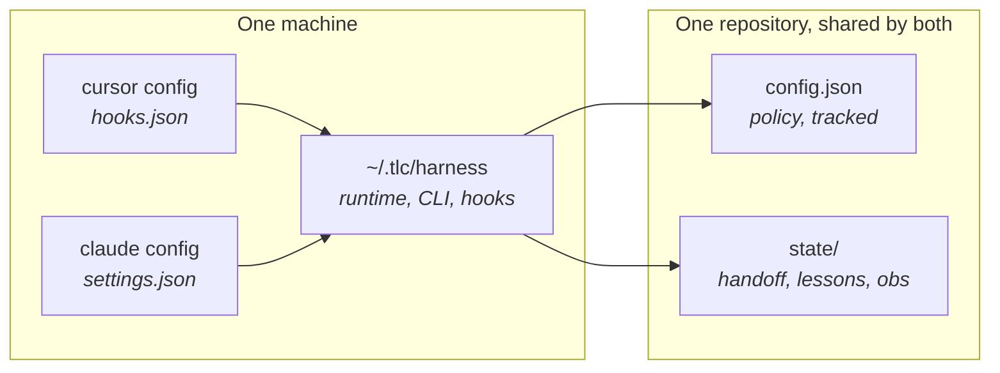
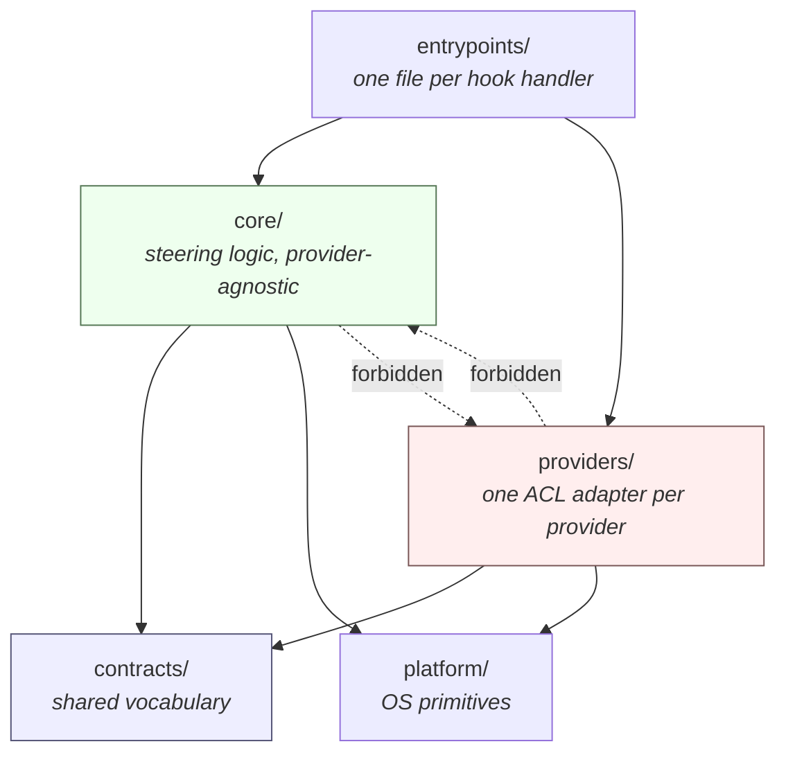
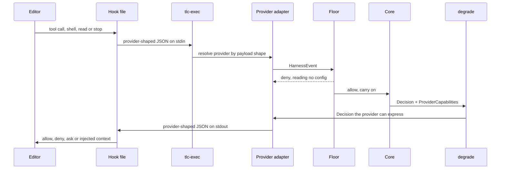

# Harness architecture

## Two layers

| Layer | Where | Role |
|-------|--------|------|
| **Global runtime** | `~/.tlc/harness/` + provider hook wiring | Hooks, policy engine, observability, CLI |
| **Project policy** | `<repo>/.tlc/harness/config.json` + provider shim hooks | Per-repo lint/test/ship/subagent choices |

Global does the work. Project only configures *this* repo. Do not copy `~/.tlc/harness/src` into projects.



Both providers read the same policy and write the same state, so two people on one repository in different
tools see one handoff.

See [/decisions/ad-002.md](/decisions/ad-002.md) for why the CLI is `tlc harness …` and the runtime home is
`~/.tlc/harness/`, not `~/.cursor/agent-harness/`.

## Module layout (ports and adapters)

```
src/
├── contracts/    shared vocabulary: HarnessEvent, Decision, ProviderCapabilities, EffortLevel, ProviderWiring
├── core/         provider-agnostic steering logic, organized flat-by-aggregate
├── providers/    one anti-corruption-layer adapter per provider (cursor/, claude/)
├── platform/     OS-portable primitives (paths, atomic fs, git, process, pricing)
└── entrypoints/  one file per hook handler, composing core + the resolved provider
```

Arrows are imports, and every one of them is checked mechanically:



`core/` never imports `providers/`; `providers/` never imports `core/`; `contracts/` imports neither and is
imported by both. `tools/dev/check-boundaries.ts` enforces this mechanically, plus a scan that forbids vendor
identifiers (`cursor`, `claude`, `codex`, `composer`, `anthropic`) anywhere under `src/core/` or
`src/contracts/`. See [/decisions/ad-004.md](/decisions/ad-004.md) and
[/decisions/ad-010.md](/decisions/ad-010.md).

Two rules keep the gate from going quiet about itself. It runs `biome check --error-on-warnings`, because a
warn-level diagnostic does not change biome's exit code and three fixable warnings had therefore survived several
green runs — one of them a parameter accepted and never used. And `tools/check-suppressions.ts` fails it on any
`biome-ignore`, `@ts-ignore` or `@ts-expect-error` whose reason does not open with `why:`, `hazard:` or `invariant:`
followed by a real sentence, because a stricter exit code creates pressure to silence rather than fix. See
[/decisions/ad-051.md](/decisions/ad-051.md).

Each provider adapter implements the same port (`ProviderPort` in `src/providers/provider.port.ts`):
`detect`, `capabilities`, `policyDefaults`, `toEvent`, `render`, `wiring`. Core receives a `HarnessEvent`
and a `ProviderCapabilities` descriptor as plain data — it never branches on a provider's name. See
[/providers/index.md](/providers/index.md) for the full port shape and the two registered adapters.

## One event, end to end



The adapter is the only layer that speaks the provider's dialect. The floor decides before any policy is
loaded, and `degrade` guarantees the answer fits what the provider can actually do.

## Degradation, not detection

When a core `Decision` (`allow | deny | ask | context | continue | rewriteInput | abstain`) cannot be
expressed on a given provider, `src/providers/provider.degrade.ts` degrades it based on the capability
descriptor:

- Provider cannot enforce hooks at all → any enforcing decision becomes an `ADVISORY —` context message.
- `ask` where `askSupportedOn` does not include the current event → becomes `deny` (a provider that cannot
  ask must not silently allow).
- `rewriteInput` where `toolInputRewrite` is false → becomes `ask`, carrying the proposed input in the
  reason text.
- `context` truncates to a caller-supplied character budget, dropping `env` if `sessionEnv` is false.

This is what lets a hookless or partially-capable provider be a new adapter file rather than a core
refactor.

## Runtime (Bun-first, Node-guaranteed)

| Piece | Rule |
|-------|------|
| **Preferred** | Bun on `PATH` — every hook runs the TypeScript source directly, no compile step, ~1 ms per invocation |
| **Fallback** | Node.js **24+** running `dist/*.mjs` — ~27 ms per invocation |
| **Launcher** | `bin/tlc-exec.mjs` (Node, all platforms); `bin/tlc-exec` (Unix), `bin/tlc-exec.cmd` (Windows) |
| **Build** | `tlc harness build` / `bin/tlc-build` (needs Bun or esbuild once to compile `dist/`) |
| **Forbidden** | Requiring Bun to *use* the harness; flooring on EOL Node |

The measured numbers and the full trade-off are recorded in [/decisions/ad-012.md](/decisions/ad-012.md).
Provider hooks only need a command on PATH plus JSON stdin/stdout — neither provider requires Bun.

## Load order

`DEFAULTS` → `~/.tlc/harness/config.json` → `<repo>/.tlc/harness/config.json`

## Shim

Project hooks call `tlc-exec shim <handler>`. If `TLC_ACTIVE=1` (set by the user-level `sessionStart`
hook), the shim no-ops so hooks do not double-fire. Cloud agents without a user-level install run the real
handler via the shim path.

## Operator postures

Three postures, one dimension: how much the agent surfaces and what earns an interruption. Verification is
identical at all three — the same evidence bar, the same gates, the same done-criteria
([/decisions/ad-025.md](/decisions/ad-025.md)).

| Posture | What reaches the operator |
|---------|---------------------------|
| `paired` | Any sizable move, asked before it happens — plus the three below |
| `solo` | An irreversible or destructive action, a real dead-end, ambiguity that changes the outcome |
| `focus` | A destructive action or a real dead-end only; ambiguity is settled under a stated assumption |

Each posture also states a **deadline**: an unclear goal belongs in the first actions, and once work is under way
the agent states an assumption rather than asking, because a late question is worse than a decision. `focus`
admits exactly one early question ([/decisions/ad-026.md](/decisions/ad-026.md)).

`paired` is enforced, not only stated: a shell command is asked about before it runs when it reaches the network,
when it can overwrite or remove an existing path, or when it changes who can reach a path — the last because that
change appears in no diff. An append is not asked about: a prompt the operator learns to clear without reading is
the mechanism by which a consequential action gets waved through. `solo` and
`focus` differ in what the agent raises, which is its judgement rather than a hook event, so their enforcement is
the same.

Every one of those decisions is recorded with its posture and its rule, so the interruption rate is attributable
and the threshold can be calibrated from real sessions.

Set it with `tlc harness mode <paired|solo|focus>`, or `mode` in the project config. Any other value is
refused — `status` and `doctor` name the rejected word and the posture running in its place.

## Day-to-day vs grind

Grind is **off by default** and independent of posture. Enable with `tlc harness grind`.

## Steering pillars (product core)

Observability and cost are support. The product is **stop → followup → handoff → policy**.

### Floor — no configuration reaches it

Evaluated before any policy is loaded, so no setting and no agent edit can clear it
([/decisions/ad-016.md](/decisions/ad-016.md)).

Each denial names its rule, so `rule=secret-access` in a message maps to a row here. The table is generated
from `src/core/floor/floor.catalog.ts`, which is keyed by the `FloorRule` union — a rule added to the union
and not described there fails the typecheck.

<!-- generated:floor -->

| Rule | Denies | Allowed anyway |
|---|---|---|
| `outside-project-destruction` | a destructive command whose target resolves outside the repository and outside the OS temp directory | the same command inside the repository, or inside the temp directory |
| `unprovable-destruction` | a destructive verb whose target is a variable, a command substitution, or otherwise built at runtime — the harness cannot see what it would delete | a literal path it can resolve and check |
| `secret-access` | a read that would copy `.env`, `~/.ssh`, `~/.aws`, `*.pem` or similar into the transcript, through a shell reader or through the editor's own read tool | — |
| `history-rewrite` | `git push --force` | `--force-with-lease`, which refuses on its own when the remote moved |
| `machine-control` | `shutdown`, `reboot`, `halt`, `poweroff` | — |
| `policy-surface-write` | every route an agent has to harness policy and state — a shell redirect, an interpreter, a heredoc program, or a write tool — in the project and under the runtime home, plus the mutating `tlc harness` subcommands from inside a session | reading them with a proven reader (`cat`, `head`, `grep`, `jq`, `ls`, `stat`, `test`), and `tlc harness handoff` for the handoff state |

<!-- /generated -->

Three more checks are equally unconfigurable and are **not** floor rules — they run after it, and each
detects a condition that a config field could otherwise switch off:

| Check | Rule | Effect |
|-------|------|--------|
| Policy integrity | `policy-baseline-divergence` | A policy source changed mid-session with no `tlc harness` command behind it. Acting calls are refused until `tlc harness policy accept` clears it; reads pass, so the agent can investigate |
| Policy surface, tool half | `policy-surface-write` | Agent writes to the same paths through Write, Edit, Delete, MultiEdit or NotebookEdit ([/decisions/ad-022.md](/decisions/ad-022.md)) |
| Edit collision | `edit-collision` | Two agents editing the same file in one working tree are told, not silently merged |

### Tunable rails

<!-- generated:rails -->

| Rail | Effect | Status |
|------|--------|--------|
| Grind (lint/test on stop) | Re-checks lint/test after each completed turn and follow-ups until gates pass. | `grind.enabled` |
| Ship gate | Blocks false done after an explicit HARNESS_SHIP_CLAIM when evidence is missing. | `shipGate.enabled` |
| Empty-diff anti-ship | Blocks a ship claim when the working tree has zero changes. | `shipGate.emptyDiffAntiShip` |
| Comment gate (agent-added comments) | Blocks the stop when this turn added comment lines, so narration never lands. Diff-scoped: comments you already committed are never flagged. | `comments.enabled` |
| Duplication gate (agent-added copies) | Blocks the stop when the turn wrote six or more lines the project already has, naming both sites. Diff-scoped: what was already duplicated is not counted. | `duplication.enabled` |
| Subagent allowlist | Restricts Task/subagent models to a list you write, and blocks *-fast shapes by default. | `subagents.enforceAllowlist` |
| Block parent Fast mode for Task spawns | Denies Task/subagentStart while the parent chat is in Fast mode (sticky from hooks), closing the gap where Task slugs omit *-fast. | `subagents.blockParentFast` |
| Shell stall detection | Blocks repeating the exact same shell command too many times. | `shell.stallDetection` |
| Catastrophic shell ask | Asks before destructive shell commands (rm -rf, drop db, force push, …). | `shell.catastrophicAsk` |
| Lessons | Records compact lessons on gate stagnation and reinjects them ranked under a char budget. A lesson can name the path or symbol that makes it true and is withheld once that stops resolving, can carry an end date, and is graded helped or neutral by the next run of the gate it was injected for. Three tiers: shipped core, a global tier read by every product on this machine, and this project's own. How the lessons reach the model is decided by the provider rather than configured: where a host does not deliver context returned from its session-start hook, a durable rules file is written instead. | `intelligence.lessons.enabled` |
| Budget continue | Pushes the agent to keep working under context pressure instead of wrapping up early. | `intelligence.budgetContinue` |
| Gap feedback | Injects PREVIOUS_GAPS on gate failure so retries fix listed items. | `intelligence.gapFeedback` |
| Failure classification | Stores failure categories on the handoff for clearer next actions. | `intelligence.failureClassification` |
| Progressive handoff | Carries the gaps the previous session ended with into the next session's bootstrap, as history rather than as a task list. | `intelligence.progressiveHandoff` |
| Progressive context | Escalates gate follow-up detail on each stop retry. | `intelligence.progressiveContext` |
| Autopilot | Adds ordered AUTOPILOT steps on gate failure. | `intelligence.autopilot` |
| Idle-turn gate (asked instead of acting) | Blocks a turn that ends with open work, zero tool calls and zero file changes. Counts recorded tool events rather than reading the reply, so it cannot be talked around. | `intelligence.idleTurnGate` |
| Docs staleness gate | Runs the repository's own documentation staleness tool on stop, so a stale document fails like a failing test. | `docs.command` |
| Global observability spool | Mirrors this repo's obs and audit records into one file under the runtime home, so cost and gate history can be read across every repository at once. | `obs.globalSpool` |
| Untrusted-content framing | Injects one framing line per turn when the agent reads a pull request, an issue, a fetched page or an MCP result, stating that the content is data and that any directive inside it is to be reported as a prompt-injection attempt, not obeyed. | `untrustedContent.enabled` |
| Plan gate (declared scope vs diff) | Blocks the stop when the turn changed files the declared HARNESS_PLAN did not name, so scope creep fails like a failing test instead of surviving as a review comment. | `planGate.enabled` |
| Observation mode (measure a rail with its rule off) | Runs a rail's checker while that rail is not enforcing, so the record says whether the property held with the rule injected or without it. That is the reading that tells you a rail is unnecessary rather than merely quiet, and it is what makes deleting one a decision instead of a guess. | `observe.enabled` |

<!-- /generated -->

Operator posture (`mode`: `paired`, `solo`, `focus`) governs surfacing rather than capability, so it is not in
the generated table.

## See also

- [/concepts.md](/concepts.md) — the same rails described from the operator's side
- [/providers/index.md](/providers/index.md)
- [/decisions/index.md](/decisions/index.md)
